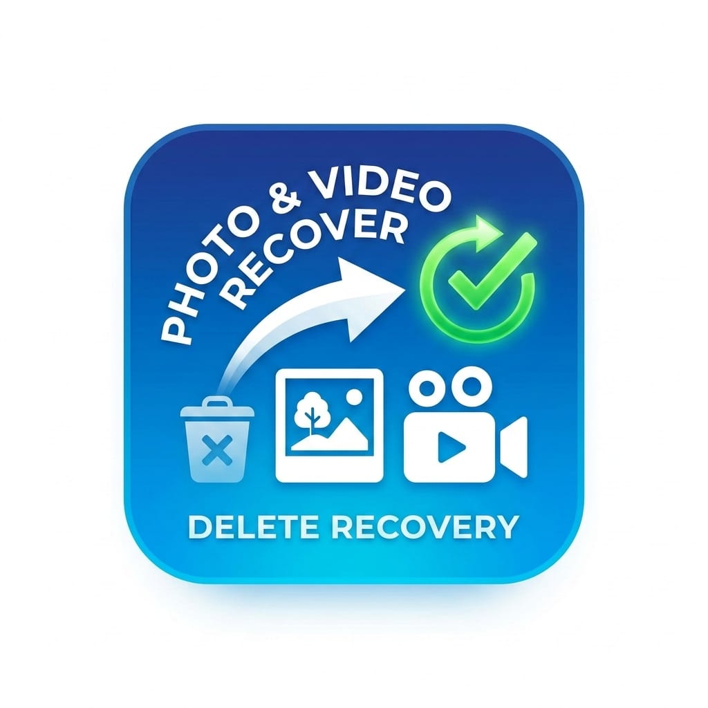

# 🔍 DeepRecover — Android Deleted File Recovery

<p align="center">
  
</p>

<p align="center">
  <a href="https://github.com/badhonmondol/recovery_app/releases/tag/v5.0.0">
    
  </a>
  
  
  
</p>

---

## 📱 What is DeepRecover?

**DeepRecover** is a Flutter-based Android app that scans your device for **deleted and recoverable files** — photos, videos, audio, and documents — and lets you restore them in one tap.

Unlike basic file managers, DeepRecover uses a **3-phase recovery engine**:

1. **MediaStore Trash Query** — queries Android's official trash (`IS_TRASHED`) and incomplete files (`IS_PENDING`) directly from MediaStore
2. **Live Path Index** — builds a complete index of all currently active files so they are excluded from results
3. **Orphan Filesystem Scan** — walks the entire storage and shows only files that are no longer tracked by MediaStore (deleted/orphaned)

> ✅ Only deleted files are shown — no clutter from existing photos or videos.

---

## ✨ Features

| Feature | Details |
|---|---|
| 🗑 Deleted Files Only | Shows only trashed, pending, and orphaned files |
| 📸 Photos | JPG, PNG, HEIC, WEBP, GIF, BMP, TIFF |
| 🎬 Videos | MP4, MKV, AVI, MOV, 3GP, FLV, WEBM |
| 🎵 Audio | MP3, M4A, WAV, FLAC, AAC, OGG, OPUS |
| 📄 Documents | PDF, DOCX, XLSX, PPTX, TXT, CSV |
| 🔎 Deep Scan | Full filesystem walk with junk filter |
| 🏷 DELETED / ORPHAN Badge | Clear visual indicator per file |
| 👁 Preview | Pinch-zoom images, video player, audio player, PDF viewer |
| 💾 Recover | One-tap restore to `/Download/Recovered/` |
| 🔗 Share | Share recovered files directly |
| 🗂 Filter & Sort | Filter by type, sort by date/name/size |
| 🌙 Dark UI | Fully dark neon-themed interface |

---

## 📸 Screenshots

> _Coming soon_

---

## 📥 Download

Download the latest APK directly:

**[⬇ DeepRecover-v5.0.0.apk](https://github.com/badhonmondol/recovery_app/releases/tag/v5.0.0)**

> Minimum Android version: **Android 6.0 (API 23)**
> Best results on: **Android 10+ (API 29+)**

---

## 🔐 Permissions Required

| Permission | Why |
|---|---|
| `READ_MEDIA_IMAGES` | Scan deleted images (Android 13+) |
| `READ_MEDIA_VIDEO` | Scan deleted videos (Android 13+) |
| `READ_MEDIA_AUDIO` | Scan deleted audio (Android 13+) |
| `READ_EXTERNAL_STORAGE` | Scan storage (Android 6–12) |
| `MANAGE_EXTERNAL_STORAGE` | Full filesystem orphan scan (Android 11+) |

> On Android 11+, grant **"All Files Access"** in Settings for the best recovery results.

---

## 🛠 How It Works

```
START SCAN
    │
    ├── Phase 1: MediaStore Trash Query (Android 10+)
    │       └── IS_TRASHED = 1  →  user deleted files
    │       └── IS_PENDING = 1  →  incomplete / interrupted files
    │       └── Confidence: 92%  •  Badge: 🗑 DELETED
    │
    ├── Phase 2: Build Live Path Index
    │       └── Fetch all currently active file paths from MediaStore
    │       └── Used to exclude live files from filesystem scan
    │
    └── Phase 3: Orphan Filesystem Scan (Background Isolate)
            └── Walks /storage/emulated/0 + SD card paths
            └── Skips any path present in live index
            └── Skips: .thumbnails, cache, .nomedia dirs, Android/data
            └── Minimum size guards (images ≥1KB, videos ≥10KB)
            └── Confidence: 80–88%  •  Badge: 👻 ORPHAN
```

---

## 🚀 Build from Source

**Requirements:**
- Flutter 3.x
- Android Studio / Android SDK
- NDK 27.0.12077973

```bash
# Clone
git clone https://github.com/badhonmondol/recovery_app.git
cd recovery_app

# Get dependencies
flutter pub get

# Run debug
flutter run

# Build release APK
flutter build apk --release
```

APK output: `build/app/outputs/flutter-apk/app-release.apk`

---

## 📦 Dependencies

| Package | Purpose |
|---|---|
| `video_player` | Video playback in preview screen |
| `video_thumbnail` | Async video thumbnails in grid |
| `photo_view` | Pinch-zoom image viewer |
| `just_audio` | Audio playback with speed control |
| `flutter_pdfview` | PDF rendering |
| `share_plus` | Share recovered files |
| `intl` | Date formatting |
| `ffi` | Native engine bridge (future use) |

---

## 📋 Changelog

### v5.0.0 — Deleted Files Only
- ✅ App now shows **only deleted/recoverable files**
- ✅ Fixed Android 13 permission bug (TIRAMISU SDK check order)
- ✅ MediaStore `IS_TRASHED` / `IS_PENDING` query (Android 10+)
- ✅ Live path index for orphan cross-reference
- ✅ DELETED 🗑 and ORPHAN 👻 badges in UI
- ✅ Separate stats: Deleted / Orphaned / Selected counts

### v4.0.0
- Dual scan: MediaStore + filesystem isolate
- Junk filter: thumbnails, cache, .nomedia excluded
- Custom scrollbar, grid/list toggle

### v1.0.0
- Initial release

---

## ⚠️ Limitations

- **Root not required** but MANAGE_EXTERNAL_STORAGE gives best results
- Files permanently wiped (overwritten) cannot be recovered
- HEIC/HEIF preview not supported (save to Gallery to view)
- Recovery restores files to `/Download/Recovered/` — original filename preserved

---

## 📄 License

MIT License © 2026 [badhonmondol](https://github.com/badhonmondol)
